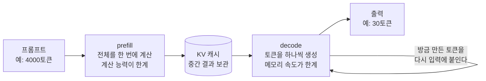
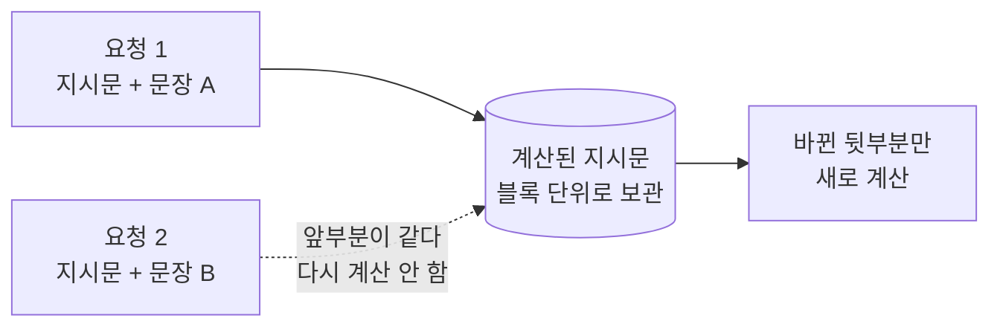
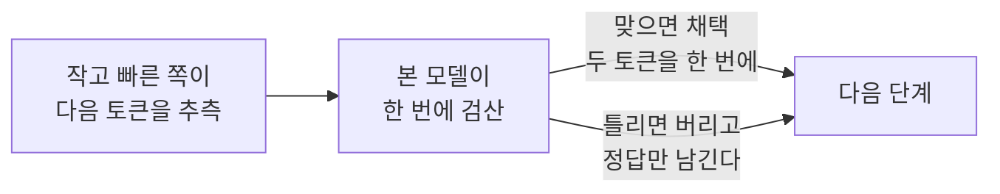

# LLM 추론 서빙

> 같은 모델·같은 GPU 라도 요청의 모양과 서버 설정에 따라 속도가 몇 배 갈린다. 그 갈림의 이유를 prefill/decode 두 단계로 나눠 이해한다.

## 개요

학습이 끝난 모델을 실제로 돌려 답을 받는 과정을 **추론(inference)** 이라 하고, 그걸 여러 요청에 대해 계속 처리하도록 띄워놓은 것을 **서빙(serving)** 이라 한다.

추론을 "모델이 크면 느리다" 정도로 이해하면 실제로 관측되는 현상이 설명되지 않는다. 더 크고 덜 압축된 모델이 더 빠른 경우가 있고, 같은 모델이 워크로드만 바뀌어도 세 배 빨라지는 경우가 있다. 이런 일이 벌어지는 이유는 **요청 하나가 성격이 완전히 다른 두 단계를 거치고, 각 단계의 한계가 서로 다른 곳에 있기 때문**이다.

이 페이지는 그 두 단계를 먼저 세우고, 나머지 용어를 전부 그 위에 올려 설명한다.

## 핵심 원칙

- **두 단계를 나눠 본다.** 프롬프트를 읽는 단계(prefill)와 답을 한 토큰씩 쓰는 단계(decode)는 병목이 다르다. 어떤 최적화가 먹힐지는 내 워크로드가 둘 중 어디에 치우쳐 있는지가 정한다.
- **한계는 둘 중 하나다.** prefill 은 GPU 의 계산 능력에, decode 는 메모리를 읽어오는 속도에 막힌다. 물리 한계에 붙은 항목은 어떤 구현으로도 못 넘으므로, 개선하려면 읽을 양 자체를 줄여야 한다.
- **처리량과 지연은 다른 값이다.** 한 요청을 빨리 끝내는 것과 초당 많은 요청을 처리하는 것은 자주 상충한다. 어느 쪽을 재는지 먼저 정하지 않으면 최적화가 서로를 상쇄한다.
- **출력을 바꾸는 최적화와 안 바꾸는 최적화를 구분한다.** 계산을 건너뛰거나 미리 추측하는 기법은 원칙적으로 결과가 같아야 한다. 결과가 달라졌다면 이득이 아니라 결함이다.

## 세부 설명

### 요청 하나가 지나는 두 단계

**prefill 은 프롬프트를 통째로 한 번에 읽는 단계다.** 프롬프트의 토큰들은 이미 다 주어져 있어 서로를 기다릴 필요가 없다. 그래서 수천 개를 한꺼번에 계산기에 밀어 넣을 수 있고, GPU 의 연산기가 꽉 찬다. 여기서 더 빨라지려면 계산량 자체가 줄어야 한다.

**decode 는 답을 한 토큰씩 만드는 단계다.** 두 번째 토큰을 만들려면 첫 번째 토큰이 먼저 나와야 하므로 순서를 건너뛸 수 없다. 문제는 **토큰 하나를 만들 때마다 모델의 가중치 전체를 메모리에서 한 번씩 읽어야 한다**는 점이다. 계산량은 얼마 안 되는데 읽어올 양이 많아, 계산기는 놀고 메모리 통로만 붐빈다.

이 차이가 만드는 결론이 하나 있다 — **decode 속도는 대략 가중치 크기를 메모리 대역폭으로 나눈 값에 붙는다.** 예를 들어 가중치가 19 GB 이고 GPU 의 메모리 대역폭이 초당 768 GB 라면, 토큰 하나에 최소 약 25 ms 가 든다. 이건 커널을 아무리 잘 짜도 못 넘는 바닥이다. 그래서 **가중치를 절반으로 줄이면 decode 가 대략 두 배 빨라진다.**

### 내 워크로드는 어느 쪽인가

두 단계 중 어디가 시간을 먹는지는 프롬프트와 출력의 길이 비로 정해진다.

| 워크로드 모양 | 지배 단계 | 잘 듣는 것 |
|---|---|---|
| 긴 지시문 + 짧은 답 (분류·추출·라벨링) | prefill | 계산량 줄이기, 계산 건너뛰기 |
| 짧은 질문 + 긴 답 (대화·글쓰기·코딩) | decode | 가중치 줄이기, 미리 추측하기 |

극단적인 예를 들면, 4000토큰 지시문에 30토큰을 답하는 작업은 **토큰의 99% 이상이 프롬프트**다. 이런 워크로드에서는 decode 를 두 배 빠르게 만드는 기법을 붙여도 전체 시간은 거의 그대로다. 가속 대상이 전체의 1%뿐이기 때문이다.

### KV 캐시 — 앞 문장을 다시 계산하지 않기 위한 저장소

decode 는 매 토큰마다 "지금까지의 문장 전체"를 참조한다. 이걸 매번 처음부터 계산하면 답이 길어질수록 느려지므로, 각 토큰의 중간 결과를 저장해두고 재사용한다. 이 저장소를 **KV 캐시**라 한다.

KV 캐시는 GPU 메모리를 차지하고, 그 크기가 **동시에 처리할 수 있는 요청 수를 정한다.** 서버가 기동할 때 찍는 "KV cache size: 176,713 tokens" 같은 숫자가 그 총량이고, 이걸 요청당 최대 길이로 나눈 값이 동시 처리 한계다. 요청 하나가 최대 8192토큰까지 쓸 수 있다면 176,713 ÷ 8192 ≈ 21 로, 21건까지 동시에 안고 갈 수 있다는 뜻이다.

그래서 **가중치를 줄이면 남는 메모리가 KV 캐시로 가서 동시성이 올라가고**, 반대로 KV 를 더 먹는 기능을 켜면 동시성이 깎인다.

### 처리량과 지연 — 같이 못 올리는 두 값

- **지연(latency)**: 요청 하나가 시작부터 끝까지 걸린 시간.
- **처리량(throughput)**: 단위 시간에 끝낸 총량. 초당 토큰 수나 초당 요청 수로 잰다.

여러 요청을 모아 한 번에 처리하는 것을 **배치(batching)** 라 한다. 배치를 키우면 GPU 가 놀지 않아 처리량이 오르지만, 한 요청 입장에서는 남을 기다리는 시간이 붙어 지연이 는다. **동시성(concurrency)** 은 그 순간 서버가 함께 안고 있는 요청 수다.

측정값을 볼 때는 어느 쪽인지 확인해야 한다. "초/샘플" 은 총 시간을 건수로 나눈 값이라 지연처럼 보이지만 실은 처리량 지표이고, 동시성을 바꾸면 같은 서버에서도 값이 크게 달라진다.

### 모델을 작게 만드는 법 — 양자화

**양자화(quantization)** 는 가중치를 더 적은 비트로 저장하는 것이다. 원본은 보통 16비트인데 이걸 8비트나 4비트로 줄이면 파일이 작아지고, 앞서 본 대로 decode 가 그만큼 빨라진다. 대신 값이 뭉개져 품질이 조금 떨어질 수 있다.

이름에 붙는 표기를 읽는 법은 이렇다.

| 표기 | 뜻 |
|---|---|
| `W4A16` | 가중치(Weight) 4비트, 활성값(Activation) 16비트. 저장만 줄이고 계산은 16비트로 한다 |
| `INT4`·`4bit`·`8bit` | 가중치 비트 수 |
| `group_size` | 스케일 값 하나를 몇 개의 가중치가 공유하는지. 32 는 128 보다 촘촘해 품질에 유리하고 용량은 는다 |
| `symmetric` | 0을 중심으로 대칭 범위를 쓰는지. 비대칭이면 표현은 정밀하지만 계산이 조금 는다 |
| `AWQ`·`GPTQ` | 어떤 가중치를 덜 뭉갤지 고르는 방식의 차이. 둘 다 널리 쓰인다 |

여기서 **놓치기 쉬운 항목이 `ignore` 다.** 양자화에서 제외할 레이어 목록인데, 여기 들어간 레이어는 원본 정밀도 그대로 남는다. 이 목록이 길면 "4비트 모델"이라는 이름과 달리 실제 파일은 훨씬 크고, decode 속도도 이름값을 못 한다. **같은 모델의 같은 비트 수 배포판끼리도 파일 크기가 크게 다르면 이 목록을 먼저 의심한다.**

### 모델을 덜 쓰는 법 — MoE

**MoE(Mixture of Experts)** 는 모델 안에 여러 개의 전문가 블록을 두고 **토큰마다 그중 일부만 통과시키는** 구조다. `35B-A3B` 같은 이름이 이걸 나타내는데, 총 파라미터는 35B 지만 토큰 하나가 실제로 지나는 것은 3B(`A` = active) 라는 뜻이다.

효과는 비대칭이다 — **메모리에는 전체를 다 올려야 하지만 계산은 일부만 한다.** 그래서 용량은 큰 모델만큼 먹으면서 속도는 작은 모델에 가깝다. 같은 크기의 일반(dense) 모델보다 몇 배 빠른 것이 보통이다.

### attention 을 싸게 만드는 법

**attention** 은 각 토큰이 문장 속 다른 토큰들을 참조하는 계산이다. 기본형(full attention)은 모든 토큰이 모든 토큰을 보므로 비용이 길이의 제곱으로 는다. 문장이 길어질수록 감당이 안 돼 여러 절충안이 나왔다.

| 방식 | 어떻게 줄이나 | 대가 |
|---|---|---|
| full attention | 줄이지 않음 | 길이의 제곱으로 비용 증가 |
| sliding window | 최근 N개 토큰만 참조 | 먼 거리 의존을 놓칠 수 있음 |
| linear attention | 과거를 고정 크기 상태로 압축해 길이에 선형 | 시퀀스마다 상태 메모리가 필요하고, 뒤에 나올 캐시 기법과 궁합이 나쁨 |

**hybrid attention** 은 이들을 섞어 쓰는 구성이다. 예를 들어 64개 레이어 중 48개는 linear, 16개는 full 로 두는 식이다. 대부분의 레이어를 싸게 처리하면서 몇 개 레이어에서만 전체를 보게 해 품질을 지키려는 설계다.

linear attention 계열에는 실무에서 걸리는 대가가 하나 더 있다. 압축된 상태를 **요청마다 따로** 들고 있어야 해서, 동시에 처리할 요청 수를 늘리면 이 상태 메모리가 같이 늘어난다. 서버 기동 중 메모리 부족으로 죽는다면 이 지점을 의심할 만하다.

### 계산을 건너뛰는 법 — prefix caching

여러 요청이 **똑같은 앞부분**을 공유하는 경우가 흔하다. 같은 지시문에 문장만 바꿔 넣는 작업이 대표적이다. 이때 앞부분의 계산 결과는 매번 같으므로, 한 번 계산해두고 재사용하면 prefill 을 통째로 건너뛸 수 있다. 이것이 **prefix caching** 이다.

세 가지를 알아두면 충분하다.

- **앞에서부터 연속으로 같아야 한다.** 뒤쪽이 우연히 같아도 소용없다. 그래서 바뀌는 내용은 프롬프트 뒤쪽에 두는 편이 유리하다.
- **블록 단위로만 재사용된다.** 일정 개수의 토큰이 모여야 한 블록이고, 꽉 차지 않은 자투리는 다시 계산한다.
- **적중률이 곧 이득이다.** 프롬프트의 90%가 공통이면 prefill 의 90%가 사라진다. 긴 지시문을 쓰는 작업에서 효과가 가장 크다.

**서버마다 켜져 있는지가 다를 수 있다는 점이 중요하다.** 한쪽만 켜진 채로 두 모델의 속도를 비교하면 모델 성능이 아니라 설정 차이를 재게 된다. 구조에 따라 기본값이 꺼지기도 한다 — 특히 linear attention 계열은 압축 상태를 블록 단위로 잘라 보관하기 까다로워, 지원이 실험 단계로 표시되고 기본으로 꺼져 있는 경우가 있다.

### 미리 추측하는 법 — speculative decoding 과 MTP

decode 가 느린 이유는 계산이 무거워서가 아니라 **토큰 하나마다 가중치를 다 읽어야** 해서였다. 그러면 한 번 읽는 김에 여러 토큰을 처리하면 이득이다. 그 발상이 **speculative decoding(추측 디코딩)** 이다.

추측이 틀리면 버리고 본 모델의 답만 남기므로 **출력은 추측 없이 돌린 것과 같아야 한다.** greedy(온도 0) 조건에서 결과가 달라졌다면 이득이 아니라 결함이다.

**MTP(Multi-Token Prediction)** 는 이 추측을 담당하는 작은 모듈을 본 모델이 함께 들고 있는 방식이다. 별도의 작은 모델을 따로 구해 짝지을 필요가 없어 운영이 간단하다.

관련 용어는 둘이면 된다.

- **draft**: 추측해서 내놓은 토큰.
- **acceptance rate(채택률)**: 추측한 토큰 중 검산을 통과한 비율. 추측 1개 설정에서 보통 90%를 넘는다.

**주의할 점은 채택률이 높아도 전체가 빨라진다는 보장이 없다는 것이다.** 이유가 둘이다.

- **가속 대상이 decode 뿐이다.** prefill 이 지배적인 워크로드에서는 전체 시간의 일부만 줄어 체감이 작다.
- **동시성을 깎는다.** 추측 토큰이 KV 캐시 자리를 차지해 함께 처리할 수 있는 요청 수가 줄어든다. 그래서 요청이 드문 상황에서는 이득이고, 부하가 높은 상황에서는 손해로 뒤집힐 수 있다.

정리하면 **짧은 프롬프트에 긴 답을 내는 저부하 작업에 맞고, 긴 지시문을 대량으로 밀어 넣는 작업에는 안 맞는다.**

### 서버를 띄울 때 만나는 설정값들

아래는 특정 서빙 엔진의 옵션 이름이라 도구가 바뀌면 이름도 바뀐다. 다만 **뒤에 있는 개념은 엔진이 달라도 대체로 같다.**

| 설정값 | 무엇을 정하나 | 잘못 주면 |
|---|---|---|
| GPU 메모리 사용률 | 서버가 카드에서 쓸 메모리 예산 | 너무 높으면 기동 중 메모리 부족, 낮으면 KV 캐시가 좁아 동시성 하락 |
| 최대 문맥 길이 | 요청 하나가 쓸 수 있는 최대 토큰 수 | 프롬프트+출력이 이 값을 넘으면 요청이 실패한다 |
| 최대 동시 요청 수 | 한 번에 안고 갈 요청 수의 상한 | 크면 기동 시 잡아두는 메모리가 늘어 실패할 수 있다 |
| CUDA graph 캡처 | 반복 실행 경로를 미리 굳혀 오버헤드를 줄이는 준비 작업 | 캡처 크기를 크게 잡으면 준비 단계에서 메모리를 크게 먹는다 |

특히 마지막 둘은 함께 움직인다. 동시 요청 수 상한이 크면 그만큼 큰 배치까지 미리 굳혀두려 하고, 그 준비 과정에서 메모리를 크게 잡는다. **모델은 올라갔는데 기동 마지막에 죽는다면 예산이 아니라 이쪽을 먼저 낮춰본다.**

실제 옵션 이름과 기동 로그로 이 설정값들을 확인하는 절차는 `concepts/vllm-serving-operations.md` 에 있다 — 어느 로그 줄에서 값이 예상과 갈렸는지로 고칠 대상을 좁히는 방법, 운영 중 통계 줄 읽는 법, 기동 실패 유형별 대처가 거기 있다.

### 용어 빠른 표

| 용어 | 한 줄 뜻 |
|---|---|
| 토큰(token) | 모델이 다루는 텍스트 조각. 한글은 대략 글자 1~2개가 1토큰 |
| prefill | 프롬프트를 한 번에 읽는 단계. 계산 능력이 한계 |
| decode | 답을 한 토큰씩 만드는 단계. 메모리 속도가 한계 |
| KV 캐시 | 앞 문장의 중간 결과 저장소. 동시 처리 수를 정한다 |
| 지연 / 처리량 | 요청 하나의 소요 시간 / 단위 시간당 총 처리량 |
| 배치·동시성 | 여러 요청을 모아 함께 처리하는 것과 그 개수 |
| 양자화 | 가중치를 적은 비트로 저장해 작고 빠르게 만드는 것 |
| `W4A16` | 가중치 4비트·활성값 16비트 |
| `group_size` | 스케일 하나를 공유하는 가중치 개수. 작을수록 정밀 |
| `ignore` | 양자화에서 제외한 레이어 목록. 길면 실제 파일이 커진다 |
| MoE / `A3B` | 토큰마다 일부 전문가만 통과. 활성 파라미터 3B |
| full / sliding / linear attention | 전부 참조 / 최근 N개만 / 고정 크기로 압축 |
| hybrid attention | 위 방식을 레이어별로 섞은 구성 |
| prefix caching | 앞부분이 같은 요청의 계산을 재사용해 prefill 을 건너뛰기 |
| speculative decoding | 다음 토큰을 미리 추측하고 본 모델이 검산 |
| MTP | 추측 모듈을 본 모델이 함께 들고 있는 방식 |
| draft / acceptance rate | 추측한 토큰 / 그중 검산을 통과한 비율 |

## 출처

- `sources/llm/vllm-inference-serving-docs.md` — prefix caching 의 블록 해시·전체 블록만 캐시되는 제약, speculative decoding 의 무손실 보장(greedy 동일성)과 저부하 편향, MTP 의 권장 추측 토큰 수와 동시성 대가
