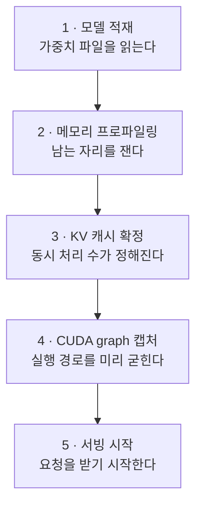

# vLLM 서버 운영

> 서버가 안 뜨거나 느릴 때 무엇을 만질지는 추측이 아니라 로그가 정한다. 기동 로그 다섯 줄이 하나의 나눗셈을 단계마다 찍은 중간값이라, 어느 줄에서 값이 예상과 갈렸는지가 곧 고칠 설정값이다.

## 개요

형제 페이지 `concepts/llm-inference-serving.md` 는 **왜 빠르고 느린가**를 다룬다 — prefill 과 decode 두 단계, KV 캐시, 양자화, prefix caching 같은 개념 축이다. 이 페이지는 그 개념들이 **실제 화면에 어떤 이름으로 나타나는가**를 다룬다. 로그 한 줄, 옵션 하나, 지표 하나가 각각 앞 페이지의 어느 개념에 붙는지를 잇는 것이 목적이다.

이름은 vLLM 것이다. 다른 엔진을 쓰면 문자열은 달라지지만, **뒤에 있는 구조 — 메모리 예산을 나눠 갖는 설정값들, 자리가 모자라면 이미 받은 요청이 되돌려지는 동작 — 는 대체로 같다.**

용어 하나만 미리 풀어둔다. **KV 캐시**는 앞서 읽은 문장의 중간 계산 결과를 담아두는 GPU 메모리 영역이고, 이 페이지에서 벌어지는 거의 모든 일이 이 영역의 크기를 두고 벌어진다.

> **검증 기준**: 소스 노트에 고정한 개발 커밋과 2026-09-14 열람 문서 기준이다. 설치한 안정 릴리스에서는 로그·기본값·지원 기능을 다시 확인한다.

## 핵심 원칙

- **기동 로그는 나눗셈의 중간값이다.** 카드 총 메모리에서 예산을 떼고, 가중치와 실행 중 임시 메모리를 빼고, 남은 자리가 문맥 길이 기준 몇 요청분인지를 센다. 로그가 이 순서대로 한 줄씩 찍히므로, **값이 예상과 처음 갈라진 줄이 원인이 있는 자리**다.
- **설정값들은 하나의 예산을 나눠 갖는다.** 문맥 길이·동시 요청 수·배치 토큰 예산은 전부 같은 KV 캐시 자리를 두고 경쟁한다. 각각 요청 길이 상한·스케줄링 상한·반복당 토큰 예산으로 역할이 다르다. 여유가 있으면 함께 늘릴 수 있지만, 실제 메모리와 지연 영향을 측정해야 한다.
- **안 뜨는 것과 느린 것은 원인이 다르다.** 기동 실패에는 메모리 외에도 모델 지원·통신·적재 문제가 있다. 운영 중 저하도 대기·계산·캐시·입력 공급을 나눠 조사한다. preemption은 그중 캐시 압박의 신호다.
- **로그 한 줄이 대시보드를 대신한다.** 엔진이 주기적으로 찍는 통계 줄이 지표 엔드포인트가 내주는 값의 요약이라, 수집 체계를 붙이지 않아도 병목 판단은 된다.

## 세부 설명

### 기동이 지나는 다섯 단계



각 단계가 로그 한 줄씩을 남긴다. 값 자리만 실행마다 바뀐다.

| 단계 | 로그 | 그 줄이 말하는 것 |
|---|---|---|
| 1 적재 | `Model loading took N GiB memory and T seconds` | 가중치가 실제로 차지한 크기. 양자화 설정이 의도대로 먹었는지가 여기서 처음 드러난다 |
| 2 프로파일링 | `Available KV cache memory: N GiB` | 예산에서 가중치와 실행 중 임시 메모리를 뺀 나머지 |
| 3 캐시 확정 | `GPU KV cache size: N tokens, Maximum concurrency for M tokens per request: X.XXx` | 그 나머지가 토큰 몇 개분인지, 그리고 동시에 몇 요청을 안는지 |
| 4 그래프 캡처 | `Capturing CUDA graphs (...)` 진행바 → `Graph capturing finished in T secs, took X GiB` | 반복 실행 경로를 굳히는 준비 작업과 그 비용 |
| 5 서빙 | 주소·포트 안내 | 기동이 완료되었다는 뜻이며 요청 처리의 정상 동작은 별도로 확인한다 |

**실패 단계는 원인을 좁히는 단서다.** 적재 중에는 파일·모델 지원·메모리, 캐시 할당 중에는 예산, 그래프 캡처 중에는 캡처 메모리와 연산 지원을 확인한다. 마지막 단계의 실패라는 이유만으로 캡처 문제라고 확정하지 않는다.

### 메모리 예산의 나눗셈

3번 줄의 숫자는 아래 순서로 만들어진다.

1. **예산 확보** — 카드 총 메모리 × `--gpu-memory-utilization` = 이 서버가 쓸 총액
2. **빼기** — 예산에서 모델 가중치, 프레임워크 밖에서 잡힌 메모리, 실행 중 활성값 최대치, CUDA graph 예상 몫을 뺀다
3. **남은 자리** — 그 나머지가 `Available KV cache memory`
4. **요청 수 환산** — 남은 자리가 문맥을 꽉 채운 요청 몇 개분인지가 동시성 배수(`Maximum concurrency ... Nx`)
5. **토큰 환산** — 그 배수에 `--max-model-len` 을 곱한 값이 `GPU KV cache size`. 두 값은 늘 이 관계로 묶여 한 줄에 함께 찍힌다

**CUDA graph 몫이 기본적으로 미리 빠진다는 점이 함정이다.** 예전 판과 같은 사용률을 줬는데 KV 캐시가 작게 잡히는 이유가 이것이고, 엔진도 로그로 "이 사용률은 그래프 회계 없을 때의 얼마에 해당한다"고 알려준다. 회계를 끄면 KV 캐시에 더 배정될 수 있지만 실제 캡처 비용은 남아 메모리 부족 위험이 생긴다.

**동시성 배수는 최악 가정의 값이다.** `33.04x` 는 "모든 요청이 문맥을 끝까지 채운다면 33개"라는 뜻이라, 실제 요청이 문맥의 10분의 1만 쓰면 그보다 훨씬 많이 안는다. 그래서 이 값이 낮다는 것만으로는 문제가 아니고, **실제 요청 길이와 견줘야 판단이 선다.** 최대 길이 한 요청의 캐시조차 할당하지 못하면 엔진의 길이 검증에서 실패할 수 있다. 표시된 배수는 실제 처리량 보장이 아니다.

### 설정값 넷이 서로를 밀어내는 구조

| 옵션 | 정하는 것 | 올렸을 때 | 내렸을 때 |
|---|---|---|---|
| `--gpu-memory-utilization` | 카드 메모리 중 이 서버 몫의 비율 | KV 캐시가 넓어져 동시 처리 수가 는다 | 여유는 생기지만 자리가 좁아진다 |
| `--max-model-len` | 요청 하나의 최대 토큰 수 | 긴 요청을 허용하며 최대 길이 기준 동시성 추정치가 작아질 수 있다 | 긴 요청이 거절되며 실제 짧은 요청의 처리량 증가는 보장되지 않는다 |
| `--max-num-seqs` | 한 배치에 담는 요청 수 상한 | 배치 활용이 좋아질 수 있으나 메모리·지연이 증가할 수 있다 | 메모리 압박을 낮추지만 처리량을 제한할 수 있다 |
| `--max-num-batched-tokens` | 한 번의 반복이 처리할 토큰 예산 | 첫 토큰까지가 빨라지고 토큰 사이 간격이 벌어진다 | 토큰 사이 간격이 고르게 좁아진다 |

### Chunked prefill — 입력을 나누어 decode와 함께 처리하기

V1은 가능한 경우 chunked prefill을 기본 활성화한다. 스케줄러는 대기 중인 decode를 먼저 배치하고, 남은 `max_num_batched_tokens` 예산에 prefill을 배치한다. 입력이 남은 예산보다 길면 여러 반복으로 나눈다.

작은 토큰 예산은 기존 요청의 ITL에 유리할 수 있고, 큰 예산은 TTFT에 유리할 수 있다. 공식 문서의 2048은 작은 예산의 예시이며, 8192 초과는 특히 큰 GPU의 작은 모델에서 **처리량**을 위한 권장 출발점이다. 모든 모델에 적용되는 최적값은 아니다.

chunked prefill을 끄면 토큰 예산과 최대 문맥 길이의 제약도 확인해야 한다. 요청 길이와 부하를 고정하고 TTFT·ITL·전체 처리량을 함께 비교한다. 옵션 하나를 낮췄다고 다른 옵션의 메모리 증가분이 정확히 상쇄되는 것은 아니다.

### 운영 중 한 줄 — 지금 상태의 요약

엔진이 주기적으로 찍는 줄은 고정 항목 여섯에 조건부 항목이 붙는다.

```
Avg prompt throughput: 0.0 tokens/s, Avg generation throughput: 0.0 tokens/s,
Running: 0 reqs, Waiting: 0 reqs, GPU KV cache usage: 0.0%, Prefix cache hit rate: 0.0%
```

`Preemptions: N` 은 되돌려진 요청이 한 번이라도 생겨야 붙는다. **이 줄이 아예 안 보이면 대개 고장이 아니라 요청이 없는 것이다** — 유휴 상태에서는 로그 수준이 내려가 화면에서 사라진다.

| 보이는 것 | 무슨 상태 | 만질 것 |
|---|---|---|
| `Waiting` 이 쌓이고 KV 사용률이 높다 | 자리가 없어 새 요청이 못 들어간다 | 사용률 상향, 또는 문맥 길이·동시 요청 수 하향 |
| `Waiting` 0 인데 `Running` 도 낮다 | 서버가 아니라 보내는 쪽이 한산하다 | 클라이언트 동시성을 올려야 배치가 찬다 |
| `Preemptions` 가 계속 는다 | 받은 요청을 되돌렸다가 다시 계산하는 중 | 즉시 부하를 줄인다. 성능 급락의 직접 원인 |
| `Prefix cache hit rate` 가 낮은데 프롬프트 앞부분이 같다 | 앞부분에 매번 달라지는 값이 섞였다 | 시각·난수 같은 값을 프롬프트 뒤로 옮긴다 |
| prompt 처리량만 높고 generation이 낮다 | 입력·출력 토큰 수 차이일 수도 있어 병목을 확정할 수 없다 | 단계별 시간과 요청 길이를 함께 확인한다 |

**되돌려짐(preemption)이 가장 중요한 신호다.** 자리가 모자라면 엔진은 요청을 거절하는 대신 이미 진행 중인 요청을 물리고 나중에 다시 계산한다. 그래서 겉으로는 거절 없이 조용히 느려지기만 하고, 이 항목을 안 보면 원인을 못 찾는다. 경고는 "there is not enough KV cache space" 라는 문구로 나온다.

### 지표로 병목 가르기

지표 엔드포인트는 위 통계 줄을 더 잘게 나눈 값을 준다. 병목을 가르는 데 실제로 쓰이는 조합은 셋이다.

- **첫 토큰이 느린가, 이후가 느린가** — `vllm:time_to_first_token_seconds` 대 `vllm:inter_token_latency_seconds`. TTFT에는 대기·입력 처리도 포함되고 ITL에는 함께 배치된 prefill의 영향도 있으므로, 두 값만으로 연산 병목을 확정하지 않는다.
- **서버가 느린가, 줄을 선 것인가** — `vllm:request_queue_time_seconds` 가 전체 지연(`vllm:e2e_request_latency_seconds`)의 큰 몫이면 대기열 지연이 크다는 뜻이다. 입력 부하와 서비스 처리율을 함께 확인한다.
- **어느 구간이 긴가** — `vllm:request_prefill_time_seconds` 대 `vllm:request_decode_time_seconds` 를 직접 비교한다.

나머지 지표는 상태 확인용이다. `vllm:num_requests_running`·`vllm:num_requests_waiting` 이 실행·대기 수, `vllm:kv_cache_usage_perc` 가 점유율(1.0 이 만석), `vllm:num_preemptions` 가 누적 되돌림 횟수다. **적중률은 직접 나오지 않는다** — 누적 카운터인 `vllm:prefix_cache_hits`와 `vllm:prefix_cache_queries`의 같은 관측 구간 증가분으로 구한다. Prometheus 노출 이름은 `_total` 접미사를 확인하고, 조회 증가분이 0인 구간은 적중률을 정의하지 않는다.

### 기동이 실패하는 자리

| 증상 | 원문의 특징 | 원인 | 대처 |
|---|---|---|---|
| 문맥 한 번이 안 들어간다 | `To serve at least one request with the model's max seq len ...` | 요청 하나 몫이 남은 자리보다 크다 | 엔진이 함께 알려주는 추정 최대 길이 이하로 문맥 길이를 낮춘다 |
| 남는 자리가 없다 | `No available memory for the cache blocks.` | 가중치가 예산을 거의 다 먹었다 | 사용률을 올리거나 더 작게 양자화된 모델로 바꾼다 |
| 마지막 단계에서 죽는다 | `Capturing CUDA graphs` 진행 중 중단 | 캡처가 예상보다 메모리를 먹는다 | `--enforce-eager` 로 캡처를 꺼 원인을 가른다. 대가는 decode 성능 |
| 프로파일링이 어긋난다 | `Error in memory profiling. Initial free memory ...` | 재는 동안 다른 프로세스가 같은 카드에서 메모리를 놨다 | 카드를 독점시킨다 |
| 적재가 안 끝난다 | 로그가 적재 단계에서 멈춘다 | 네트워크 저장소나 스왑 스래싱 | 로컬 디스크로 옮긴다. 적재가 원인인지는 더미 적재로 가른다 |
| 메모리가 예상보다 크게 잡힌다 | `Hybrid KV cache manager is disabled ...` | sliding window 레이어를 full attention 으로 취급해 캐시를 잡는다 | 해당 버전의 hybrid cache 지원과 비활성화 설정을 확인하고 예산을 조정한다 |

**두 번째와 세 번째를 헷갈리면 시간을 크게 버린다.** 둘 다 메모리 부족으로 보이지만, 앞은 예산 나눗셈이 실패한 것이라 사용률·문맥 길이로 풀고 뒤는 준비 작업이 실패한 것이라 캡처를 꺼서 푼다. **가르는 기준은 로그가 어디까지 갔는가** — 캐시 확정 줄이 이미 찍혔다면 나눗셈은 성공한 것이다.

### 용어 빠른 표

| 이름 | 한 줄 뜻 |
|---|---|
| `Available KV cache memory` | 예산에서 가중치·임시 메모리를 뺀 나머지 |
| `GPU KV cache size` | 그 나머지를 토큰 개수로 환산한 값 |
| `Maximum concurrency ... Nx` | 모든 요청이 문맥을 꽉 채운다는 가정의 동시 처리 수 |
| `Graph capturing` | 반복 실행 경로를 미리 굳히는 기동 준비 작업 |
| `--gpu-memory-utilization` | 카드 메모리 중 이 서버가 쓸 비율 |
| `--max-model-len` | 요청 하나의 최대 토큰 수 |
| `--max-num-seqs` | 한 배치에 담는 요청 수 상한 |
| `--max-num-batched-tokens` | 한 번의 반복이 처리할 토큰 예산 |
| `--enforce-eager` | 그래프 캡처를 끄는 스위치. 기동·메모리 문제를 격리할 수 있으나 정상 상태의 성능 영향은 측정한다 |
| preemption | 자리가 모자라 진행 중인 요청을 물리고 나중에 다시 계산하는 동작 |
| `Running` / `Waiting` | 지금 처리 중인 요청 수 / 자리를 기다리는 요청 수 |
| `GPU KV cache usage` | KV 캐시 점유율. 만석에 가까우면 되돌림이 시작된다 |
| `Prefix cache hit rate` | 앞부분 재사용으로 건너뛴 비율 |
| TTFT / ITL | 첫 토큰까지의 시간 / 토큰 사이 간격 |

## 출처

- `sources/llm/vllm-serving-operations-docs.md` — 기동 로그·통계 줄의 원문 포맷, 동시성 배수가 토큰 수보다 먼저 계산된다는 점, CUDA graph 회계의 기본 활성과 그 효과, preemption 경고 원문과 대처 우선순위, 지표 이름·유형, chunked prefill 스케줄링, 기동 오류 원문
